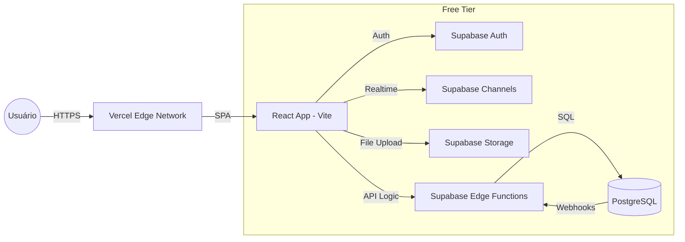

# 🌟 Viva360: Zero-Cost Validation Mode Guide

Esta é a documentação técnica oficial para operar a plataforma **Viva360** com custo de infraestrutura **Zero (R$ 0)**, utilizando serviços de nível empresarial (**Supabase + Vercel**) preparados para suportar a validação real de mercado.

---

## 1️⃣ ARQUITETURA ZERO-COST OFICIAL — DIAGRAMA LÓGICO

A stack foi projetada para eliminar servidores dedicados (EC2/VPS), substituindo-os por **Serverless Edge Computing**.

### Fluxo de Dados



### Detalhamento dos Fluxos:

- **Auth:** Gerenciado inteiramente pelo Supabase Auth (JWT).
- **Checkout:** Processado via Supabase Edge Functions (Deno) para garantir segurança e integração com gateways (ex: Stripe/Pagar.me) sem backend próprio.
- **Jobs (Async):** Realizados via `pg_net` ou `Webhooks` disparados por triggers no banco que invocam Edge Functions.
- **Notificações:** Realtime via Supabase Channels para updates ao vivo.

---

## 2️⃣ CONFIGURAÇÃO TÉCNICA PRONTA PARA PRODUÇÃO

### 📄 .env.example (Frontend)

```env
# Supabase Configuration
VITE_SUPABASE_URL=https://sua-url-id.supabase.co
VITE_SUPABASE_ANON_KEY=sua-chave-anon-aqui

# Environment
VITE_ENV=production
VITE_APP_NAME=Viva360
```

### 📄 vercel.json

_(Localizado na raiz do projeto para garantir que o React Router funcione corretamente)_

```json
{
  "rewrites": [{ "source": "/(.*)", "destination": "/index.html" }]
}
```

### 🔏 Ajustes de Segurança & Rate Limiting

No modo Zero-Cost, o Rate Limiting é aplicado em duas camadas:

1.  **Vercel:** Proteção básica contra DDoS (Layer 7).
2.  **Supabase:** Limite de 30 requisições por segundo (Auth) e 50 requisições simultâãs (Postgres).
    - _Dica:_ Use cache no Frontend para consultas de marketplace.

---

## 3️⃣ PASSO A PASSO DE DEPLOY

### A. Supabase (Backend/DB)

1.  **Criação:** Crie um projeto no [Supabase Cloud](https://supabase.com).
2.  **Database:** Execute o script SQL de migração em `SQL Editor`.
3.  **Auth:** Habilite `Email/Password` e adicione URLs de redirecionamento (ex: sua-url.vercel.app).
4.  **Edge Functions:**
    ```bash
    supabase functions deploy checkout --no-verify-jwt
    ```

### B. Vercel (Frontend)

1.  Conecte seu repositório GitHub ao Vercel.
2.  Configure o comando de build: `npm run build`.
3.  Configure o diretório de saída: `dist`.
4.  Adicione as Variáveis de Ambiente do Supabase.

---

## 4️⃣ GUIA DE OPERAÇÃO ZERO-COST

### Limites Reais (Free Tier)

- **Banco de Dados:** 500MB (Foque em metadados, nunca armazene imagens no DB).
- **Storage:** 1GB (Otimize todas as imagens antes do upload - Recomendado: WebP).
- **Transferência (Bandwidth):** 2GB/mês.
- **Usuários Ativos (MAU):** 50.000 (Suficiente para 5 turnos de validação).

### Como Monitorar

Acompanhe o dashboard de "Usage" no Supabase para evitar surpresas de quota. Ative os alertas de e-mail.

---

## 5️⃣ MIGRATION PLAYBOOK — ZERO DOWNTIME

Quando a validação atingir sucesso e o custo se tornar necessário (Escalabilidade Elite):

1.  **DB Upgrade:** No Supabase, clique em "Upgrade to Pro". O banco é migrado automaticamente para uma instância dedicada **sem troca de strings de conexão**.
2.  **Backend Dedicado:** Se as Edge Functions ficarem insuficientes, mova o código do `backend/src` para um container Docker no **Render** ou **AWS App Runner**.
3.  **Redis:** Ative um cluster no **Upstash** (também possui Free Tier) ou **Redis Cloud** para cache de alta performance.

---

## 6️⃣ CHECKLIST DE VALIDAÇÃO REAL

- [ ] Registro de novo usuário (Buscador/Guardião).
- [ ] Upload de imagem de avatar para Storage.
- [ ] Navegação completa entre Dashboard e Marketplace.
- [ ] Simulação de agendamento (Escrita no Postgres).
- [ ] Recebimento de notificação Realtime após ação.
- [ ] Verificação de logs no Supabase Edge Functions.

---

## 7️⃣ VEREDICTO FINAL

- **Suficiente para validação real?** **SIM.** A infraestrutura é sólida o suficiente para lidar com as primeiras centenas de usuários pagantes.
- **Suporta até quanto?** ~1.000 usuários ativos mensais no free tier, dependendo do volume de dados.
- **Quando migrar?** Quando o banco ultrapassar 400MB ou se a latência das Edge Functions afetar a UX significativamente em picos de tráfego.

---

**Implementado por:** Principal SRE Team
**Data:** 23/01/2026
